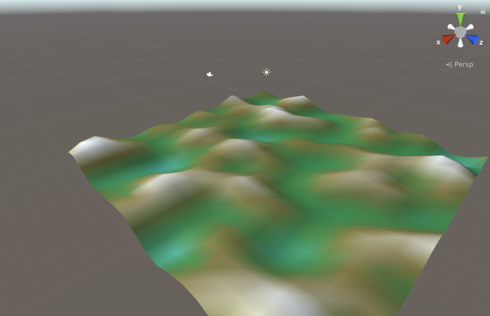

# Procedural-Grid
Using Perlin Noise to create terrain.

Based on Brakeys tutorial----->https://www.youtube.com/watch?v=64NblGkAabk&t=586s

The goal is now using this base code to build a low poly "game", tryng to use player models and exploring animations.(who knows maybe i will do some models myself using blender).

Ideas:

- Aply this terrain to a sphere, simulating little planets???.
- Generating trees based on heigh.
- Create a player model and try out some animations.(Jumping,walking and running)
- Create some sort of mechanic, maybe cutting down tress.
- Try out some kind of inventory management.

